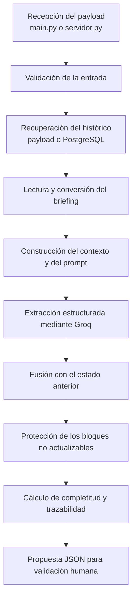
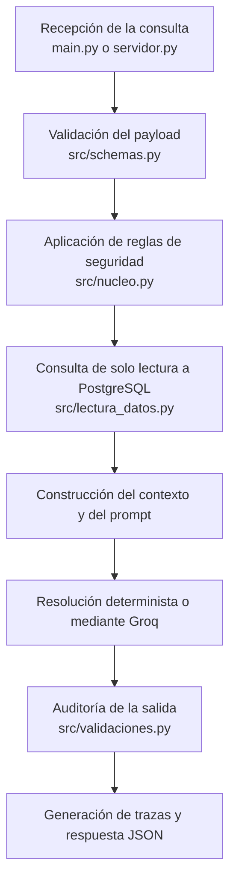
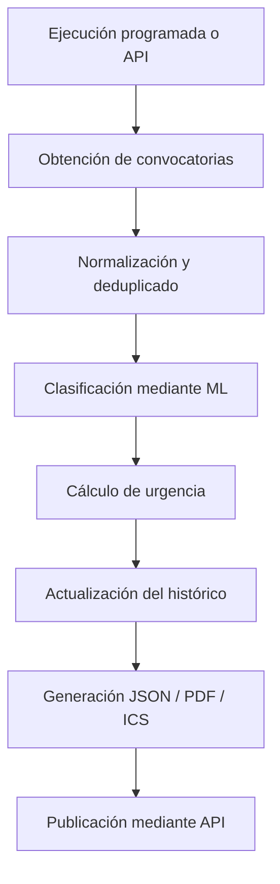
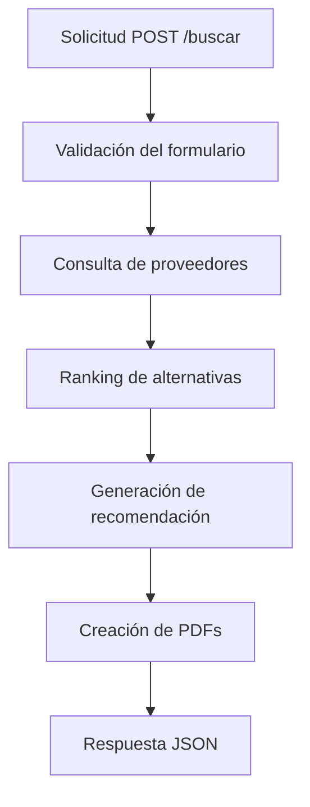
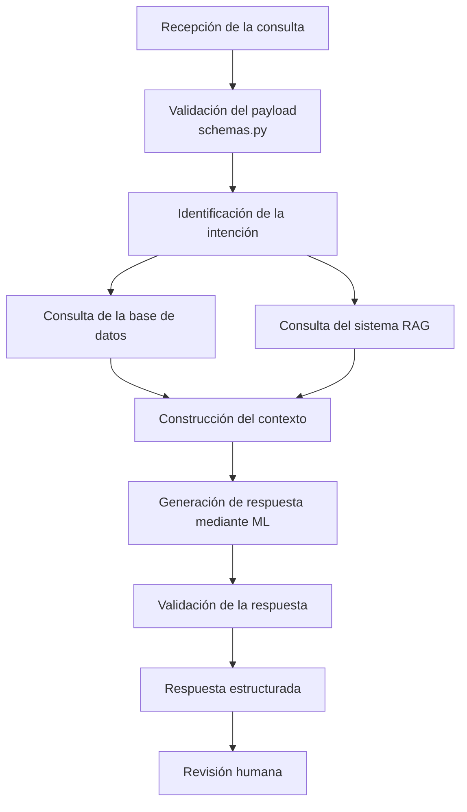
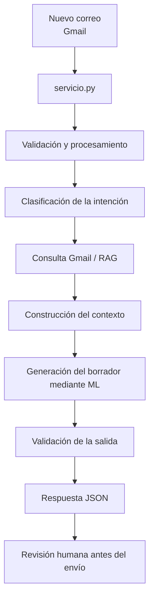

# **Memoria técnica_v01** Desafío de Tripulaciones **MITÜMI** | Agencia de eventos boutique

- [**Memoria técnica\_v01** Desafío de Tripulaciones **MITÜMI** | Agencia de eventos boutique](#memoria-técnica_v01-desafío-de-tripulaciones-mitümi--agencia-de-eventos-boutique)
  - [**RESUMEN EJECUTIVO**](#resumen-ejecutivo)
      - [*Fase 1. Identificación de fuentes y recopilación de datos*:](#fase-1-identificación-de-fuentes-y-recopilación-de-datos)
      - [*Fase 2. Diseño e implementación de la base de datos*:](#fase-2-diseño-e-implementación-de-la-base-de-datos)
      - [*Fase 3. Diseño y desarrollo de la aplicación web*:](#fase-3-diseño-y-desarrollo-de-la-aplicación-web)
      - [*Fase 4. Desarrollo e integración de agentes de IA*:](#fase-4-desarrollo-e-integración-de-agentes-de-ia)
  - [**1. Introducción**](#1-introducción)
  - [**2. Objetivos específicos**](#2-objetivos-específicos)
  - [**3. Fases de trabajo**](#3-fases-de-trabajo)
    - [*3.1. Identificación de fuentes y recopilación de datos*](#31-identificación-de-fuentes-y-recopilación-de-datos)
    - [*3.2. Diseño e implementación de la base de datos*](#32-diseño-e-implementación-de-la-base-de-datos)
    - [*3.3. Diseño y desarrollo de la aplicación web*](#33-diseño-y-desarrollo-de-la-aplicación-web)
    - [*3.4. Desarrollo e integración de agentes de IA*](#34-desarrollo-e-integración-de-agentes-de-ia)
      - [3.4.1. Documentación de agentes](#341-documentación-de-agentes)
        - [a) Agente de automatización y autorrellenado de documentos (`operis`)](#a-agente-de-automatización-y-autorrellenado-de-documentos-operis)
        - [b) Agente de consulta y recuperación de información interna (`lumen`)](#b-agente-de-consulta-y-recuperación-de-información-interna-lumen)
        - [c) Agente de monitorización y alertas de concursos públicos (`vigil`)](#c-agente-de-monitorización-y-alertas-de-concursos-públicos-vigil)
        - [d) Agente de búsqueda y planificación de viajes para ponentes (`jano`)](#d-agente-de-búsqueda-y-planificación-de-viajes-para-ponentes-jano)
        - [e) Agente conversacional de comunicación y coordinación logística con ponentes (`hermes`)](#e-agente-conversacional-de-comunicación-y-coordinación-logística-con-ponentes-hermes)
        - [f) Agente de clasificación y gestión del correo electrónico (`garum`)](#f-agente-de-clasificación-y-gestión-del-correo-electrónico-garum)
  - [**4. Resultados obtenidos**](#4-resultados-obtenidos)
  - [**5. Costes de ejecución**](#5-costes-de-ejecución)
  - [**6. Mejoras y planes a futuro**](#6-mejoras-y-planes-a-futuro)

---
<div style="text-align: justify">

## **RESUMEN EJECUTIVO**

El proyecto aborda el diseño y desarrollo de una aplicación web Full Stack, destinada a centralizar la gestión integral de eventos en una plataforma única, intuitiva y escalable. La solución permite crear, planificar y supervisar eventos, consultar su estado e histórico, y gestionar la logística de los ponentes. Incorpora además agentes de Inteligencia Artificial (IA) especializados, con el fin de automatizar la carga de tareas repetitivas, optimizar tiempos operativos y mejorar la coordinación entre los participantes.

EL proyecto se divide en las siguientes fases de trabajo, 

#### *Fase 1. Identificación de fuentes y recopilación de datos*: 
Esta fase se centra en identificar y reunir información procedente de distintas fuentes relevantes para el proyecto. Su objetivo es construir una base de conocimiento amplia y útil que incluya datos sobre ponentes, eventos, instituciones, oportunidades y otros contenidos de interés para MITÜMI.

#### *Fase 2. Diseño e implementación de la base de datos*:
En esta fase se diseña e implementa la base de datos del proyecto, definiendo su estructura, las entidades necesarias y las relaciones entre ellas. La base de datos permite almacenar y organizar de forma centralizada la información sobre eventos, ponentes, instituciones, tareas, sedes y oportunidades de interés para MITÜMI. Asimismo, se establecen mecanismos que facilitan la consulta, actualización e integración de los datos con la aplicación web y los agentes de inteligencia artificial.

#### *Fase 3. Diseño y desarrollo de la aplicación web*: 
En esta fase se diseña y desarrolla una plataforma web que permite consultar, gestionar y aprovechar la información recopilada. La aplicación busca ofrecer una experiencia sencilla e intuitiva, convirtiendo los datos procesados en una herramienta accesible y útil para el equipo de MITÜMI.

#### *Fase 4. Desarrollo e integración de agentes de IA*:
Esta fase consiste en identificar procesos manuales, recurrentes y de alto consumo de tiempo que puedan automatizarse mediante agentes de IA. Los agentes desarrollados ayudan en tareas como el autorrellenado de documentos, la comunicación con ponentes, consultas internas a la base de datos, la detección de concursos públicos, la gestión de viajes y la organización del correo electrónico. Su finalidad es reducir la carga operativa, minimizar errores y permitir que el equipo se concentre en actividades de mayor valor.

---
## **1. Introducción**

La organización de eventos requiere coordinar múltiples tareas, recursos y participantes. Cuando la información necesaria se encuentra distribuida entre diferentes herramientas y procesos, pueden producirse dificultades en la planificación, problemas de comunicación y una pérdida de visibilidad sobre el estado de cada actividad. La digitalización y centralización de estos procesos permite mejorar la eficiencia operativa, facilitar el seguimiento de las distintas fases del evento y optimizar la colaboración entre los participantes.

El presente proyecto tiene como objetivo desarrollar una aplicación web Full Stack destinada a centralizar la gestión integral de eventos en una plataforma única e intuitiva. El sistema permite crear, planificar y supervisar eventos, consultar su estado general, gestionar las tareas asociadas y acceder al histórico de actividades realizadas.

La plataforma incorpora funcionalidades orientadas a la planificación de eventos, la gestión logística de los ponentes, el seguimiento de tareas y la organización de la información. De esta forma, proporciona al equipo de MITÜMI una visión centralizada de los recursos y procesos relacionados con cada evento.

Como elemento diferencial, la solución integra un conjunto de agentes especializados de Inteligencia Artificial (IA) que colaboran en la automatización de procesos operativos. Estos agentes intervienen en tareas como la gestión y el autorrellenado de documentos, la comunicación con ponentes, la administración del correo electrónico, la consulta de información interna, la planificación de desplazamientos y la detección de oportunidades relacionadas con concursos públicos. Esta arquitectura permite reducir el trabajo repetitivo, minimizar errores y mejorar los tiempos de gestión.

Desde el punto de vista técnico, el proyecto adopta una arquitectura Full Stack compuesta por un frontend, encargado de proporcionar una experiencia de usuario dinámica e intuitiva, y un backend, responsable de implementar la lógica de negocio, gestionar la información y coordinar las integraciones del sistema. Esta separación facilita el mantenimiento de la aplicación, su evolución y la incorporación de nuevas funcionalidades.

En conjunto, la introducción original tiene el contenido necesario, pero esta versión presenta una estructura más clara y un tono más apropiado para una memoria técnica.

---
## **2. Objetivos específicos**

1. Identificar fuentes de información relevantes, así como recopilar, depurar y actualizar datos sobre sedes, instituciones y oportunidades de interés para MITÜMI, con el fin de construir una base de conocimiento fiable y actualizada.
   
2. Diseñar e implementar una base de datos estructurada que permita almacenar, organizar, relacionar y consultar de forma segura y eficiente la información sobre eventos, ponentes, instituciones, tareas y oportunidades de interés para MITÜMI.
   
3. Diseñar y desarrollar una aplicación web Full Stack que centralice la consulta, gestión, planificación y supervisión de los eventos y de la información asociada.
   
4. Implementar una interfaz intuitiva, accesible y adaptada a las necesidades del equipo de MITÜMI, sobre una arquitectura escalable que facilite el mantenimiento y la incorporación de futuras funcionalidades.
   
5. Desarrollar agentes de IA que automaticen procesos recurrentes, como la gestión de documentos, la comunicación con ponentes, la planificación de viajes y la administración del correo electrónico, con el fin de reducir la carga operativa, los tiempos de gestión y los errores manuales.

---
## **3. Fases de trabajo** 

### *3.1. Identificación de fuentes y recopilación de datos*
Durante esta fase se identificaron diferentes fuentes públicas y se recopilaron los datos necesarios para alimentar la base de datos utilizada en el desarrollo de la aplicación. El trabajo se organizó en dos líneas principales: la recopilación de información sobre espacios y salas para eventos y la obtención de datos para el resto de las entidades del sistema.

Para las entidades relacionadas con espacios y salas, se utilizó como fuente principal el portal público [Basque Events](https://www.basque-events.com/es). La información obtenida se trasladó inicialmente a hojas de cálculo, donde se homogeneizó y organizó de acuerdo con la estructura definida para el proyecto. Posteriormente, los datos se exportaron en dos archivos CSV, correspondientes a las tablas de espacios y salas. La validación se realizó contrastando cada registro con la fuente original. La recopilación de estos datos se limitó geográficamente al País Vasco, atendiendo al ámbito de actividad del cliente.

Para completar las tablas de clientes, estados, eventos, ponentes, relación entre eventos y ponentes, presupuestos y usuarios, se consultaron distintas fuentes públicas y especializadas. Entre las principales fuentes utilizadas se encuentran:

- **SPRI (Agencia Vasca de Desarrollo Empresarial)**: permitió obtener referencias sobre el ecosistema empresarial vasco, incluyendo sectores de actividad, empresas y otra información corporativa.

- **Guías profesionales de gestión de eventos**: se utilizaron como referencia para definir datos relacionados con los estados de los eventos, los presupuestos y la vinculación entre eventos, ponentes y servicios logísticos.

- **Turismo Euskadi y los Convention Bureaus**: sirvieron como referencia para representar los procesos habituales de organización de eventos corporativos, especialmente en lo relativo a los datos de contacto, los servicios disponibles, la gestión de ponentes y los presupuestos.

- **eInforma**: se empleó como fuente complementaria para obtener información empresarial, como denominaciones sociales, ubicaciones y provincias.

También se recopiló documentación de eventos mediante la plataforma interna y se prepararon nueve archivos CSV, uno por cada tabla contemplada en este flujo de trabajo. Durante la verificación se comprobó que los archivos incluyeran las tablas y los campos requeridos. Cuando un dato no pudo verificarse mediante fuentes públicas, se registró como valor nulo para evitar la incorporación de información no contrastada.

El número de registros varió en función de cada tabla, situándose entre 3 y 120 registros. Se tomó como referencia una cantidad aproximada de 40 registros por tabla cuando la disponibilidad de información lo permitió. Una vez finalizados los trabajos de recopilación, organización y validación, los archivos se entregaron al equipo encargado del desarrollo Full Stack para su incorporación a la base de datos.

Los datos empleados proceden de fuentes públicas o fueron generados con fines de desarrollo y prueba. Por tanto, no pertenecen a la base de datos operativa real de MITÜMI y deberán sustituirse progresivamente por la información proporcionada por la empresa.

### *3.2. Diseño e implementación de la base de datos*


### *3.3. Diseño y desarrollo de la aplicación web*


### *3.4. Desarrollo e integración de agentes de IA*
En esta fase se desarrollan e integran agentes de IA orientados a automatizar tareas recurrentes relacionadas con la organización de eventos. Brevemente, un agente de IA es un sistema de software autónomo que tiene la capacidad de razonar, planificar y actuar para cumplir un objetivo específico. A diferencia de un chatbot convencional, estos agentes no se limitan a responder preguntas, sino que pueden interpretar una solicitud, dividirla en subtareas, consultar información y ejecutar acciones mediante su conexión con aplicaciones, bases de datos y servicios externos.

Su funcionamiento se apoya en modelos de lenguaje (ML), mecanismos de planificación, sistemas de memoria, técnicas de recuperación de información y herramientas conectadas mediante API. Estos componentes permiten que cada agente seleccione los recursos necesarios y siga una secuencia de acciones para alcanzar un objetivo previamente definido.

El flujo de funcionamiento de un agente sigue las siguientes etapas:

**1. Comprensión y descomposición**: el agente analiza la instrucción inicial del usuario y la divide en subtareas más pequeñas y manejables, usando el motor de planificación.

**2. Planificación**: determina qué pasos debe seguir y en qué orden para cumplir el objetivo principal.

**3. Consulta de memoria y RAG**: recupera información previa relevante (memoria) y, si es necesario, busca en documentos o datos externos proporcionados por el usuario (RAG).

**4. Uso de herramientas**: mediante sus integraciones y APIs, accede a aplicaciones, bases de datos o navegadores web para obtener datos o ejecutar acciones concretas (consultar el correo, leer un documento, buscar en internet, etc.).

**5. Ejecución autónoma**: lleva a cabo las acciones planificadas (redactar un correo, buscar una fecha en el calendario, subir un video) sin requerir supervisión constante del usuario.

**6. Aprendizaje**: evalúa si sus acciones anteriores tuvieron éxito y ajusta su comportamiento futuro en función de ese resultado.

<figure>
  
  <figcaption>Figura 1. Flujos de funcionamiento de un agente de IA. </figcaption>
</figure>

En el proyecto, los agentes se especializan en diferentes procesos, como la automatización y autorrellenado de documentos,  la consulta de información almacenada en la base de datos, la búsqueda y planificación de viajes para ponentes, la detección de oportunidades relacionadas con concursos públicos, la comunicación y coordinación logística con ponentes, y la administración del correo electrónico.

La integración de estos agentes con la aplicación web permite centralizar su uso y automatizar parte de los flujos de trabajo del equipo de MITÜMI. De este modo, se busca reducir la carga operativa, minimizar los errores manuales y mejorar los tiempos de gestión. Debido a que los agentes pueden consultar información y realizar acciones sobre otros sistemas, se establecen objetivos y límites de actuación claros, manteniendo la supervisión humana en aquellos procesos que requieren validación.

#### 3.4.1. Documentación de agentes

##### a) Agente de automatización y autorrellenado de documentos (`operis`)

**1. Identificación y propósito:**

`operis` es el agente de extracción y actualización documental de MITÜMI. Su función es transformar briefings y documentos de un evento en una propuesta JSON normalizada, preparada para su revisión antes de incorporarse a Ágora.

`operis` recibe la información mediante `main.py`—como interfaz de línea de comandos— o `servidor.py` —como API Flask— y la procesa a través del punto de entrada común:

```python
ejecutar_agente(payload)
```

`operis` analiza el briefing, recupera el estado anterior del evento y fusiona ambos contenidos. El resultado es una propuesta JSON estructurada que **siempre requiere validación humana**.

| Campo | Descripción |
|---|---|
| Nombre del agente | `operis` |
| Tipo | Agente de extracción y actualización documental |
| Estado | MVP |
| Modo de operación | Propuesta con validación humana obligatoria |

**2. Capacidades y alcance funcional:**

`operis` procesa documentación en formatos TXT, PDF y DOCX para identificar y organizar la información relevante de un evento. Sus capacidades principales son:

- Extraer datos correspondientes al evento, el cliente, los ponentes y la `nota_bene`.
- Fusionar la información nueva con el estado anterior del evento, conservando los datos que no hayan sido modificados.
- Realizar actualizaciones completas o parciales mediante los bloques `evento`, `cliente`, `ponentes` y `nota_bene`.
- Construir una `nota_bene` con información de presupuesto, servicios, riesgos y tareas detectadas.
- Recuperar el histórico incluido en el payload o, cuando sea necesario, consultarlo en PostgreSQL mediante una conexión de solo lectura.
- Detectar campos pendientes y calcular el porcentaje de completitud del evento.
- Mantener trazabilidad sobre las fuentes consultadas y el procesamiento realizado.
- Dejar vacía cualquier información que no figure en los documentos, sin completar datos mediante suposiciones.

Por ejemplo, `operis` puede recibir un briefing en PDF con información de fechas, cliente, asistentes, presupuesto y necesidades técnicas; convertirlo en datos estructurados; y fusionarlo con la información ya disponible del evento. Si el documento solo actualiza el presupuesto, el agente puede modificar exclusivamente `nota_bene` y mantener sin cambios los demás bloques.

**3. Arquitectura y componentes:**
**REVISAR CON NORA**

`operis` se organiza en la carpeta `agente_operis_llm/`. Su diseño separa las interfaces de entrada, el núcleo de procesamiento, la integración con el ML y el acceso de solo lectura a la base de datos.

Los componentes principales cumplen las siguientes responsabilidades:

- `main.py` permite ejecutar el agente desde la línea de comandos.
- `servidor.py` expone el agente mediante una API Flask.
- `src/agente.py` implementa el punto de entrada obligatorio `ejecutar_agente(payload)`.
- `src/nucleo.py` coordina la validación, extracción, fusión y protección de bloques.
- `src/validaciones.py` verifica el contrato de entrada y las condiciones de seguridad.
- `src/lectura_archivos.py` convierte los documentos TXT, PDF y DOCX en texto procesable.
- `src/lectura_bd.py` adapta la información recuperada de la base de datos al esquema utilizado por `operis`.
- `src/llm.py` integra el modelo de ``Groq`` encargado de generar la propuesta estructurada.
- `src/schemas.py` define la estructura de los datos y el contrato de salida.
- `integrations/` contiene la integración con PostgreSQL, limitada a operaciones de lectura.
- `prompts/` almacena las instrucciones utilizadas para extraer y normalizar la información.
- `inputs/` y `outputs/` contienen, respectivamente, los payloads de entrada y las respuestas JSON generadas.

Aunque el proyecto conserva un módulo relacionado con RAG, esta funcionalidad no se utiliza actualmente. El contexto necesario se obtiene del briefing y del último estado disponible del evento.

**4. Flujo de funcionamiento**



El procesamiento se realiza en las siguientes etapas:

1. `main.py` o `servidor.py` recibe el payload y llama a `ejecutar_agente(payload)`.
2. El agente valida el contrato de entrada antes de procesar el contenido.
3. Recupera el histórico incluido en el payload o consulta el estado anterior en PostgreSQL mediante una conexión de solo lectura.
4. Convierte el briefing a texto cuando procede de un archivo TXT, PDF o DOCX.
5. Construye el contexto y el prompt con la información documental y el último estado disponible.
6. El modelo de ``Groq`` extrae los datos y genera una propuesta JSON conforme al esquema definido.
7. La nueva información se fusiona con el histórico del evento.
8. Los bloques excluidos de la actualización se restauran mediante código para evitar modificaciones accidentales.
9. El agente calcula el porcentaje de completitud, identifica campos pendientes y añade las trazas de ejecución.
10. Devuelve una propuesta JSON estructurada para su revisión humana.

**5. Seguridad, permisos y límites**

Sus permisos se definen mediante las siguientes restricciones:

```python
ALLOW_DB_WRITE = False
ALLOW_EXTERNAL_SEND = False
ALLOW_CREATE_EVENT = False
ALLOW_AUTO_APPROVAL = False
```

En consecuencia, `operis`:

- **No** escribe directamente en la base de datos ni crea eventos nuevos.
- **No** envía correos, mensajes o notificaciones.
- **No** confirma reservas, espacios, proveedores u otros servicios.
- **No** aprueba presupuestos, cambios de estado o modificaciones operativas.
- **No** ejecuta acciones reversibles o irreversibles sobre la plataforma.
- **No** invoca directamente a otros agentes.
- **No** inventa información que no esté presente en el briefing o en el histórico.
- **No** persiste automáticamente ninguna propuesta; toda salida requiere validación humana.

**REVISAR**
La base de datos es la fuente de verdad del sistema y `operis` únicamente puede consultarla en modo de solo lectura. Los documentos recibidos se consideran datos de entrada, no instrucciones con autoridad sobre el agente. Además, la protección de las actualizaciones parciales se implementa mediante código, de manera que los bloques no seleccionados mantengan su contenido anterior.

Las tareas que quedan fuera de su alcance corresponden a otros componentes del sistema:

**6. Configuración y ejecución**

La configuración del agente se carga mediante variables de entorno. Para utilizar el ML debe configurarse la credencial correspondiente de ``Groq`` y, cuando se requiera recuperar el histórico desde Ágora, una conexión a PostgreSQL con permisos de solo lectura.

`operis` ofrece dos formas principales de ejecución:

- `main.py`, para el procesamiento local desde la línea de comandos.
- `servidor.py`, para integrar el agente mediante una API Flask.

Los payloads de ejemplo se almacenan en `inputs/`, mientras que las propuestas generadas se guardan en `outputs/` como respuestas JSON. La salida conserva el mismo formato estructurado con independencia de la interfaz utilizada para invocar el agente.

**7. Síntesis**

`operis` constituye la capa de extracción y normalización documental de MITÜMI. Su diseño combina lectura de documentos, acceso de solo lectura a PostgreSQL, procesamiento mediante ``Groq`` y mecanismos deterministas de fusión y protección de datos. El agente convierte información no estructurada en una propuesta JSON trazable, identifica datos pendientes y permite actualizaciones parciales sin alterar los bloques no seleccionados. Al no disponer de permisos de escritura ni de ejecución externa, `operis` mantiene la base de datos como fuente de verdad y delega en la validación humana y en el backend cualquier persistencia o actuación real sobre la plataforma.

##### b) Agente de consulta y recuperación de información interna (`lumen`)

**1. Identificación y propósito:**

`lumen` es el agente de consulta interna de MITÜMI. Su función es responder, en lenguaje natural, preguntas sobre la información ya registrada en Ágora, incluyendo datos de eventos, presupuestos, ponentes, ponencias, salas, espacios y clientes.

`lumen` opera exclusivamente en modo de solo lectura. Recibe una consulta mediante `main.py` —en ejecución local— o `servidor.py` —como API para el frontend React— y la procesa a través del punto de entrada común:

```python
ejecutar_agente(payload)
```

El resultado es una respuesta JSON estructurada. `lumen` no modifica datos ni ejecuta acciones sobre la plataforma.

| Campo | Descripción |
|---|---|
| Nombre del agente | `lumen` |
| Tipo | Agente de consulta interna |
| Estado | MVP |
| Modo de operación | Solo lectura y generación de respuestas |

**2. Capacidades y alcance funcional:**

`lumen` permite consultar la información de Ágora mediante preguntas formuladas en lenguaje natural. Sus capacidades principales son:

- Responder consultas sobre un evento, cliente, ponente, ponencia, sala, espacio o presupuesto concreto.
- Cruzar información relacionada entre distintas tablas del esquema de Ágora.
- Resolver consultas agregadas, como conteos, totales y comparativas entre eventos.
- Identificar la ausencia de un filtro imprescindible —por ejemplo, el evento o el intervalo temporal— y solicitar únicamente la aclaración necesaria.
- Indicar de forma explícita cuándo un dato no existe o no está disponible, sin estimarlo ni inventarlo.
- Aportar trazabilidad sobre las fuentes y los campos consultados.

Por ejemplo, ante la pregunta «*¿el ponente del evento X todavía no ha subido su presentación?*», `lumen` relaciona el evento con su ponencia y comprueba el contenido de `ponencias.presentacion_link`, asociándolo con `ponentes.nombre_ponente`. También puede responder preguntas agregadas como «¿cuál es el presupuesto total aprobado para los eventos de este trimestre en Madrid?».

**3. Arquitectura y componentes:**
**REVISAR CON NORA**
`lumen` se entrega como una carpeta autocontenida denominada `lumen_agente_04/`. En una futura integración dentro del monorepo de Ágora, su ubicación prevista sería `src/agents/lumen_copilot/`.

Los componentes cumplen las siguientes responsabilidades:

- `main.py` ofrece una consola con memoria de conversación y un modo `--demo` de una sola ejecución.
- `servidor.py` expone una API Flask para el frontend React y mantiene la memoria por sesión.
- `src/agente.py` implementa el punto de entrada obligatorio `ejecutar_agente(payload)`.
- `src/nucleo.py` coordina la clasificación de la consulta y selecciona la estrategia de respuesta.
- `src/lectura_datos.py` y `integrations/db_backend.py` concentran el acceso de solo lectura a PostgreSQL.
- `src/llm.py` integra el modelo de ``Groq`` mediante una API compatible con OpenAI.
- `src/schemas.py` define el contrato de entrada y salida.
- `src/validaciones.py` audita la respuesta y aplica las restricciones de seguridad.
- `data/rag/documentos/esquema_bd.md` actúa como fuente de referencia del esquema de tablas y campos.

**4. Flujo de funcionamiento**



El procesamiento se realiza en las siguientes etapas:
1. `main.py` o `servidor.py` recibe el payload y llama a `ejecutar_agente(payload)`.
2. `src/schemas.py` valida la entrada mínima. El campo `tipo_peticion` es obligatorio, mientras que `id_evento` puede ser nulo.
3. Antes de utilizar el ML, `src/nucleo.py` aplica reglas deterministas. Las consultas sobre la tabla `usuarios`, credenciales o información restringida se bloquean con riesgo alto; las solicitudes que impliquen escritura se bloquean con riesgo medio.
4. Cuando la consulta se refiere a un evento, el agente recupera de PostgreSQL los datos necesarios mediante una conexión configurada como `readonly=True`. Algunos patrones concretos, como la consulta de billetes de ida o vuelta, se resuelven directamente mediante lógica determinista.
5. Para las preguntas libres, el agente construye el contexto del evento y genera la respuesta con ``Groq``, utilizando el modelo `llama-3.3-70b-versatile` cuando existe una `GROQ_API_KEY` válida.
6. Si no se proporciona `id_evento` y la consulta no coincide con una regla previa, un clasificador ML de respaldo asigna la petición a una de seis categorías cerradas. La categoría permite seleccionar una rama determinista existente; el clasificador no genera SQL ni aporta datos.
7. `src/validaciones.py` revisa siempre la salida para impedir fugas de información o propuestas de escritura. Además, fuerza `acciones_propuestas` y `borradores_generados` a permanecer vacíos.
8. El agente devuelve una respuesta JSON estructurada con las fuentes consultadas y una marca temporal.

**5. Seguridad, permisos y límites**

El modo seguro de `lumen` es una restricción arquitectónica permanente. Los permisos se fijan en `config/permisos.py` y se verifican desde `src/agente.py`:

```python
ALLOW_DB_WRITE = False
ALLOW_EXTERNAL_SEND = False
ALLOW_CREATE_EVENT = False
ALLOW_AUTO_APPROVAL = False
```
En consecuencia, `lumen`:

- **No** ejecuta ni sugiere sentencias `INSERT`, `UPDATE`, `DELETE` o `ALTER`.
- **No** escribe en la base de datos, ni siquiera en un supuesto modo de ejecución controlada.
- **No** consulta la tabla `usuarios` ni expone credenciales.
- **No** aprueba o modifica presupuestos, fechas, reservas, viajes o proveedores.
- **No** realiza acciones reversibles o irreversibles sobre la plataforma.
- **No** genera exportaciones masivas de datos personales, salvo una petición explícita y limitada a un evento o ponente concreto.

La única vía de acceso a los datos es `integrations/db_backend.py`, mediante una conexión PostgreSQL de solo lectura. La salida se somete a una auditoría final para detectar solicitudes de escritura, referencias prohibidas a usuarios o credenciales y posibles fugas de información.

**6. Configuración y ejecución**

La configuración se carga desde las variables de entorno. `.env.example` documenta los valores necesarios, mientras que el archivo `.env`, que puede contener `GROQ_API_KEY` y `DATABASE_URL`, no debe incluirse en el repositorio.

`lumen` ofrece dos formas principales de ejecución:

- `main.py`, para uso local mediante consola, conversación con memoria o demostración con `--demo`;
- `servidor.py`, para exponer el agente mediante una API Flask consumida por el frontend React.

El payload de ejemplo se encuentra en `inputs/payload_demo.json`, y las respuestas generadas durante la demostración se almacenan en `outputs/respuestas_json/`.

**7. Síntesis**

`lumen` constituye la capa conversacional de consulta de MITÜMI sobre los datos existentes en Ágora. Su diseño combina acceso de solo lectura a PostgreSQL, resolución determinista, generación de lenguaje natural y una auditoría final de seguridad. La prohibición de escribir, ejecutar acciones o acceder a información restringida se aplica mediante código antes y después de la intervención del ML. De este modo, el agente facilita el acceso a la información operativa sin alterar la fuente de datos ni asumir funciones propias del backend o de otros agentes especializados.

##### c) Agente de monitorización y alertas de concursos públicos (`vigil`)

**1. Identificación y propósito:**
**Preguntar a Roberto qué es Backstage y API HTTP**

`vigil` es el agente de monitorización de licitaciones públicas de MITÜMI. Su función es consultar diariamente la Plataforma de Contratación Pública de Euskadi [(*KontratazioA*)](https://www.contratacion.euskadi.eus/inicio/), identificar las licitaciones potencialmente relevantes para la actividad de MITÜMI y publicar los resultados para su consumo por la plataforma BackStage.

`vigil` opera de forma automática mediante un proceso programado o bajo
demanda a través de su API HTTP. Recopila la información, la estructura
mediante MLs y la pone a disposición de la plataforma
sin intervenir en la gestión administrativa de los concursos.

| Campo | Descripción |
|---|---|
| Nombre del agente | `vigil` |
| Tipo | Agente de vigilancia de licitaciones |
| Estado | MVP |
| Modo de operación | Lectura, clasificación y publicación de resultados |

**2. Capacidades y alcance funcional:**

`vigil` automatiza la detección de oportunidades de contratación pública
relevantes para MITÜMI.

Sus capacidades principales son:

-   Consultar diariamente las licitaciones publicadas por las
    diputaciones forales de Araba, Bizkaia y Gipuzkoa.
-   Extraer y estructurar la información de cada convocatoria.
-   Clasificar la relevancia mediante un ML.
-   Detectar modificaciones sobre concursos ya conocidos.
-   Calcular el nivel de urgencia según los días hábiles restantes.
-   Generar etiquetas temáticas para facilitar la revisión.
-   Mantener un histórico completo en SQLite.
-   Publicar un fichero JSON y calendarios `.ics`.
-   Exponer toda la información mediante una API REST.

Por ejemplo, cuando se publica una nueva licitación relacionada con la
organización de eventos institucionales, `vigil` identifica la
convocatoria, evalúa su relevancia para MITÜMI, calcula su urgencia,
genera las etiquetas correspondientes y la incorpora automáticamente al
histórico y a la salida consumida por BackStage.

**3. Arquitectura y componentes:**
**Revisar con Nora**

`vigil` se distribuye como un módulo independiente del ecosistema
MITÜMI. Su integración prevista dentro del monorepo sería
`src/agents/vigil/`.

Los principales componentes cumplen las siguientes responsabilidades:

-   `main.py` orquesta el proceso completo de búsqueda y clasificación.
-   `sources.py` obtiene las convocatorias mediante Playwright y
    BeautifulSoup.
-   `extractor.py` estructura la información mediante un ML.
-   `relevance.py` determina la relevancia y genera etiquetas temáticas.
-   `dedupe.py` detecta nuevas convocatorias y modificaciones.
-   `urgency.py` calcula el nivel de urgencia.
-   `history.py` mantiene el histórico en SQLite.
-   `publisher.py` genera los ficheros JSON y `.ics`.
-   `api.py` expone la API HTTP para la plataforma.
-   `pliego_pdf.py` genera el resumen PDF de cada concurso.

**4. Flujo de funcionamiento**


El procesamiento se realiza en las siguientes etapas:

1.  `main.py` inicia la ejecución programada o bajo demanda.
2.  `sources.py` consulta *KontratazioA* y obtiene las convocatorias
    recientes.
3.  `dedupe.py` identifica nuevas licitaciones o modificaciones.
4.  `extractor.py` estructura la información utilizando `Groq` y `Pydantic`.
5.  `relevance.py` determina si la convocatoria resulta relevante para
    MITÜMI.
6.  `urgency.py` calcula el nivel de prioridad según el plazo
    disponible.
7.  `history.py` registra todas las convocatorias en SQLite.
8.  `publisher.py` genera el JSON diario y los archivos `.ics`.
9.  `api.py` expone el histórico y permite lanzar nuevas ejecuciones.

**5. Seguridad, permisos y límites**

El modo seguro de `vigil` impide cualquier modificación sobre las
plataformas consultadas.

En consecuencia, `vigil`:

-   **No** presenta ofertas ni participa en licitaciones.
-   **No** toma decisiones sobre la concurrencia a concursos.
-   **No** ejecuta acciones administrativas externas.

La única información persistente corresponde al histórico SQLite y a los
ficheros generados para consumo interno. Las credenciales se gestionan
mediante variables de entorno y el acceso externo se limita a la API
HTTP.

**6. Configuración y ejecución - REVISAR CON ROBERTO**

La configuración se realiza mediante variables de entorno como
`GROQ_API_KEY`, `VIGIL_OUTPUT_DIR`, `VIGIL_DB_PATH` y
`VIGIL_CORS_ORIGINS`.

`vigil` puede ejecutarse manualmente mediante `python -m vigil.main`, de
forma programada mediante GitHub Actions o bajo demanda utilizando la
API HTTP. También dispone de un modo demostración (`VIGIL_DEMO=1`) que
permite recorrer todo el pipeline sin depender de ``Groq`` ni de
*KontratazioA*.

**7. Síntesis**

`vigil` constituye la capa de inteligencia para la detección automática
de licitaciones públicas dentro del ecosistema MITÜMI. Su arquitectura
combina extracción web, ML, cálculo de urgencia,
almacenamiento histórico y publicación mediante API para ofrecer a
BackStage una visión actualizada de las oportunidades de contratación,
sin intervenir en los procesos administrativos ni modificar las fuentes
oficiales.

##### d) Agente de búsqueda y planificación de viajes para ponentes (`jano`)

**1. Identificación y propósito:**

`jano` es el agente de gestión de viajes para los ponentes de
MITÜMI. Su función es generar propuestas de alojamiento y transporte a
partir de la información proporcionada por la plataforma y por el
organizador del evento, ofreciendo recomendaciones acompañadas de
informes descargables.

`jano` opera como un servicio de búsqueda bajo demanda. Recibe una
solicitud desde la plataforma mediante la API `POST /buscar`, consulta
los proveedores disponibles, calcula la mejor combinación de opciones y
devuelve una respuesta JSON estructurada junto con dos informes en PDF,
sin realizar reservas ni compras.

| Campo | Descripción |
|---|---|
| Nombre del agente | `jano` |
| Tipo | Agente de gestión de viajes |
| Estado | MVP |
| Modo de operación | Búsqueda y generación de propuestas |

**2. Capacidades y alcance funcional:**

`jano` automatiza la búsqueda de soluciones logísticas para los ponentes de un evento.

Sus capacidades principales son:

-   Buscar hoteles, vuelos, trenes, taxis y coches de alquiler.
-   Combinar la información del evento con las preferencias del ponente.
-   Seleccionar la mejor alternativa mediante reglas de ranking.
-   Generar recomendaciones justificadas mediante IA.
-   Crear dos informes PDF: uno para el ponente y otro para MITÜMI.
-   Devolver resultados estructurados mediante una API HTTP.

Por ejemplo, cuando un organizador solicita opciones de viaje para un ponente, `jano` calcula las fechas de desplazamiento, busca alojamiento y transporte, selecciona la combinación más adecuada y devuelve enlaces de compra junto con los informes correspondientes.

**3. Arquitectura y componentes:**
**REVISAR CON ROBERTO/NORA**

`jano` se distribuye como un módulo independiente del ecosistema
MITÜMI. Su integración prevista dentro del monorepo sería
`src/agents/mercurio/`.

Los principales componentes cumplen las siguientes responsabilidades:

-   `main.py` permite ejecutar el agente en modo local.
-   `servicio.py` coordina el proceso completo de búsqueda.
-   `schemas.py` define los contratos de entrada y salida.
-   `sources.py` integra los proveedores de hoteles y transporte.
-   `ranking.py` selecciona la mejor combinación y genera la
    explicación.
-   `pdf_report.py` construye los informes PDF.
-   `api.py` expone la API HTTP para búsquedas y descarga de informes.
-   `demo.py` proporciona datos simulados para demostraciones.

**4. Flujo de funcionamiento**



El procesamiento se realiza en las siguientes etapas:

1.  La plataforma envía una solicitud mediante `POST /buscar`.
2.  `schemas.py` valida la información recibida.
3.  `servicio.py` calcula el intervalo del viaje y determina los
    servicios solicitados.
4.  `sources.py` consulta los proveedores de alojamiento y transporte.
5.  `ranking.py` evalúa las alternativas y selecciona la combinación más
    adecuada.
6.  `pdf_report.py` genera un informe para el ponente y otro para
    MITÜMI.
7.  El agente devuelve una respuesta JSON con las recomendaciones y los
    enlaces de descarga.   

**5. Seguridad, permisos y límites**

El modo seguro de `jano` impide la ejecución de acciones sobre
proveedores externos.

En consecuencia, `jano`:

-   **No** reserva hoteles, vuelos ni transportes.
-   **No** realiza compras en nombre de MITÜMI.
-   **No** modifica información de la plataforma.
-   **No** envía automáticamente los informes a los ponentes.
-   **No** ejecuta acciones irreversibles sobre servicios externos.

La información se utiliza únicamente para generar propuestas de viaje y
recomendaciones. Las credenciales de proveedores se gestionan mediante
variables de entorno.

**6. Configuración y ejecución**
**REVISAR CON ROBERTO/NORA**
La configuración del agente se realiza mediante variables de entorno
para los proveedores externos y el ML.

`jano` puede ejecutarse mediante `python serve_demo_mercurio.py` en
modo demostración o desplegarse como servicio HTTP utilizando
`waitress-serve` sobre `api.py`. El modo demo permite recorrer todo el
flujo sin depender de APIs externas.

**7. Síntesis**

`jano` constituye la capa especializada de planificación de viajes
dentro del ecosistema MITÜMI. Su arquitectura combina búsqueda de
proveedores, reglas de selección, generación de recomendaciones mediante
IA y creación automática de informes PDF para facilitar la organización
logística de los ponentes. El agente actúa exclusivamente como asistente
de planificación y nunca ejecuta reservas ni operaciones sobre
proveedores externos.

##### e) Agente conversacional de comunicación y coordinación logística con ponentes (`hermes`)

**1. Identificación y propósito:**

`hermes` es el agente de asistencia a ponentes de MITÜMI. Su función es
responder, en lenguaje natural, a las consultas realizadas por los
ponentes de un evento utilizando la información registrada en Ágora y la
documentación disponible mediante el sistema RAG.

`hermes` opera en modo de solo lectura y generación de propuestas. Recibe una consulta e identifica la intención del usuario, consulta las fuentes de información
necesarias y devuelve una respuesta estructurada sin ejecutar acciones
sobre la plataforma.

| Campo | Descripción |
|---|---|
| Nombre del agente | `hermes` |
| Tipo | Agente de asistencia a ponentes |
| Estado | MVP |
| Modo de operación | Solo lectura y generación de respuestas |

**2. Capacidades y alcance funcional:**

`hermes` permite resolver consultas formuladas por los ponentes de un
evento utilizando tanto la información operativa almacenada en Ágora
como la documentación disponible mediante recuperación aumentada (RAG).

Sus capacidades principales son:

-   Responder consultas relacionadas con la participación de un ponente en un evento.
-   Consultar la agenda, horarios y programación del evento.
-   Recuperar información sobre hoteles, vuelos y transportes asociados al ponente.
-   Consultar documentación técnica y material disponible para el evento.
-   Buscar información histórica mediante el sistema RAG.
-   Generar respuestas contextualizadas utilizando un ML.
-   Elaborar borradores de respuesta para canales de comunicación como Telegram.
  
Por ejemplo, ante una consulta como *«¿A qué hora comienza mi ponencia y
en qué sala se celebra?»*, `hermes` recupera la información del evento,
identifica la sesión correspondiente al ponente y responde indicando el
horario, la sala y cualquier información adicional relevante. Del mismo
modo, puede responder preguntas como *«¿Cuál es el hotel asignado para
mi estancia?»* o *«¿Dónde puedo descargar la documentación del
evento?»*.

**3. Arquitectura y componentes:**

`hermes` se distribuye como un módulo independiente dentro del
ecosistema MITÜMI. En la integración definitiva dentro del monorepo de
Ágora, su ubicación prevista sería `src/agents/hermes/`.

Los principales componentes cumplen las siguientes responsabilidades:

-   `agente.py` implementa el núcleo del agente y coordina todo el flujo
    de resolución de consultas.
-   `rag.py` recupera información documental para enriquecer el contexto
    de las respuestas.
-   `tools.py` agrupa las herramientas de acceso a la información
    disponible.
-   `funciones.py` contiene funciones auxiliares reutilizables por el
    resto de módulos.
-   `parametros.py` centraliza la configuración general del agente.
-   `schemas.py` define el contrato de entrada y salida.
-   `pruebas.py` recoge los casos de prueba y validación funcional.
-   `ejemplos/` incluye ejemplos de utilización y pruebas del agente.

**4. Flujo de funcionamiento**


El procesamiento se realiza en las siguientes etapas:

1.  El usuario realiza una consulta al sistema y se envía la petición a `agente.py`.
2.  El agente valida el payload recibido mediante `schemas.py`.
3.  Se identifica la intención de la consulta y se determina qué fuentes de información deben utilizarse.
4.  Cuando es necesario, se consulta la base de datos en modo de solo lectura para recuperar la información del evento.
5.  Paralelamente, el sistema RAG busca documentación relevante que complemente el contexto.
6.  El agente construye un contexto unificado e invoca el ML para generar una respuesta en lenguaje natural.
7.  La respuesta se valida para comprobar su consistencia, formato y cumplimiento de las restricciones de seguridad.
8.  El agente devuelve una respuesta estructurada.
9.  Las posibles acciones derivadas de la respuesta quedan siempre sujetas a validación humana.

**5. Seguridad, permisos y límites**

`hermes` mantiene un funcionamiento seguro basado en el principio de mínima capacidad.

En consecuencia, el agente:

-   **No** modifica la base de datos.
-   **No** envía mensajes automáticamente a los usuarios.
-   **No** reserva hoteles, vuelos ni transportes.
-   **No** ejecuta acciones sobre la plataforma sin autorización explícita.
-   **No** realiza operaciones irreversibles.

Además:

-   Todas las entradas recibidas se validan antes de su procesamiento.
-   Las credenciales se gestionan mediante variables de entorno.
-   Se aplican mecanismos de protección frente a ataques de *Prompt Injection*.
-   El agente cumple las restricciones de privacidad y RGPD.
-   Todas las respuestas se generan en formato estructurado.
-   El funcionamiento queda registrado mediante distintos niveles de trazabilidad y *logging*.

**6. Configuración y ejecución**

La configuración del agente se realiza mediante variables de entorno, donde se almacenan las credenciales necesarias para acceder al ML y al resto de servicios. `hermes` puede ejecutarse de forma independiente durante las fases de desarrollo y prueba.

El contrato de entrada y salida se define en `schemas.py`, permitiendo su integración homogénea con el resto de agentes del ecosistema.

**7. Síntesis**

`hermes` constituye el agente especializado de MITÜMI para la atención personalizada a los ponentes de un evento. Su arquitectura combina consultas de solo lectura sobre la información operativa, recuperación documental mediante RAG y generación de respuestas contextualizadas utilizando MLs. Su diseño garantiza que todas las respuestas se produzcan dentro de un entorno seguro, sin ejecutar acciones sobre la plataforma y manteniendo siempre la supervisión de un operador humano.

##### f) Agente de clasificación y gestión del correo electrónico (`garum`)

**1. Identificación y propósito:**

`garum` es el agente de gestión inteligente de correos de MITÜMI. Su función es analizar los correos electrónicos recibidos, clasificarlos, consultar el contexto disponible y generar propuestas de respuesta estructuradas para su revisión antes del envío.

`garum` opera como un asistente inteligente y nunca envía mensajes de forma autónoma Recibe los nuevos correos mediante `servicio.py`, coordina su procesamiento a través de `src/agente.py` y devuelve un
resultado estructurado para que un usuario decidan la acción final.

| Campo | Descripción |
|---|---|
| Nombre del agente | `garum` |
| Tipo | Agente de gestión inteligente de correos |
| Estado | MVP |
| Modo de operación | Solo lectura y generación de borradores |

**2. Capacidades y alcance funcional:**

`garum` automatiza el análisis inteligente del correo electrónico utilizando ML, recuperación documental (RAG) y
servicios de Google.

Sus capacidades principales son:

-   Leer automáticamente nuevos correos mediante Gmail API.
-   Clasificar el contenido y detectar la intención del mensaje.
-   Consultar el histórico documental mediante RAG para aportar contexto.
-   Generar borradores de respuesta adaptados al contenido recibido.
-   Mantener memoria temporal para evitar reprocesamientos.
-   Registrar la actividad para auditoría y trazabilidad.
-   Devolver respuestas estructuradas en formato JSON.

Por ejemplo, ante un correo solicitando disponibilidad para una reunión,
`garum` identifica la intención, recupera conversaciones relacionadas
mediante RAG, consulta la información necesaria y genera un borrador de
respuesta listo para revisión, sin enviarlo automáticamente.

**3. Arquitectura y componentes:**

`garum` se distribuye como un módulo independiente del Ágora. En una futura integración en el monorepo de Ágora, su ubicación prevista sería `src/agents/garum/`.

Los principales componentes cumplen las siguientes responsabilidades:

-   `main.py` permite ejecutar el agente de forma local durante el desarrollo.
-   `servicio.py` monitoriza la llegada de nuevos correos y coordina el procesamiento.
-   `src/agente.py` implementa el núcleo del agente y orquesta el flujo de resolución.
-   `src/gmail.py` gestiona la autenticación OAuth y el acceso a Gmail.
-   `src/rag.py` recupera información histórica para enriquecer el contexto.
-   `src/llm.py` integra el ML.
-   `src/memoria.py` mantiene el contexto temporal de procesamiento.
-   `src/tools.py` y `src/funciones.py` agrupan las herramientas y utilidades auxiliares.
-   `src/parametros.py` centraliza la configuración del agente.

**4. Flujo de funcionamiento**



El procesamiento se realiza en las siguientes etapas:

1.  `servicio.py` detecta un nuevo correo.
2.  El mensaje se envía al núcleo del agente.
3.  Se clasifica automáticamente la intención del correo.
4.  Se consulta el histórico mediante RAG cuando resulta necesario.
5.  Se construye el contexto de la conversación.
6.  El ML genera un borrador de respuesta.
7.  El resultado se valida antes de devolverse.
8.  El agente devuelve una respuesta JSON estructurada.
9.  Un usuario revisa y decide si el borrador debe enviarse.

**5. Seguridad, permisos y límites**

El modo seguro de `garum` constituye una restricción arquitectónica permanente.

En consecuencia, `garum`:

-   **No** envía correos automáticamente.
-   **No** elimina mensajes del buzón.
-   **No** modifica el histórico documental del sistema RAG.
-   **No** escribe directamente en la base de datos.
-   **No** sustituye la validación humana.
-   **No** ejecuta acciones irreversibles sobre servicios externos.

Además:

-   Las credenciales se almacenan mediante variables de entorno.
-   El acceso a Gmail se realiza mediante OAuth.
-   Toda la actividad queda registrada mediante logs.
-   La salida siempre se devuelve en formato JSON estructurado.
-   Si un servicio auxiliar falla, el agente mantiene el procesamiento siempre que sea posible.

**6. Configuración y ejecución**

La configuración del agente se realiza mediante variables de entorno para las credenciales de Gmail y del ML.

`garum` puede ejecutarse localmente mediante `main.py` o como servicio continuo mediante `servicio.py`, que monitoriza la llegada de nuevos correos y activa el procesamiento automáticamente.

El histórico documental utilizado por el sistema RAG se almacena en `data/rag/` mientras que los borradores y las respuestas estructuradas se generan en `outputs/`.

**7. Síntesis**

`garum` constituye la capa conversacional de gestión inteligente del correo electrónico dentro del ecosistema MITÜMI. Su arquitectura combina la lectura de Gmail, recuperación documental mediante RAG, memoria temporal y generación de lenguaje natural para asistir al usuario en la gestión diaria de comunicaciones. El agente nunca envía mensajes de forma autónoma, manteniendo la supervisión humana como requisito imprescindible antes de cualquier acción externa.

---
## **4. Resultados obtenidos**
---
## **5. Costes de ejecución**

Además del desarrollo técnico del sistema multiagente, se ha realizado un estudio económico cuyo objetivo es determinar el coste real de explotación de la plataforma, estimar el consumo de MLs y analizar la viabilidad del despliegue en producción.

Este estudio permite conocer:

- Coste de cada agente IA.
- Coste mensual y anual del sistema.
- Consumo de tokens.
- Comparativa entre distintos LLMs.
- Costes de infraestructura.
- Evolución histórica del gasto.

Todo el estudio ha sido desarrollado mediante un libro Excel parametrizable, permitiendo modificar fácilmente el número de consultas, los modelos utilizados o los costes de despliegue.

---
## **6. Mejoras y planes a futuro**


</div>